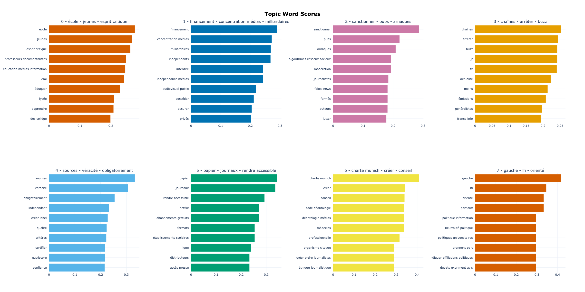
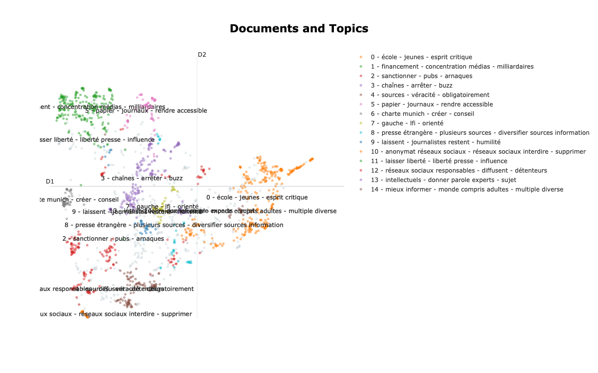
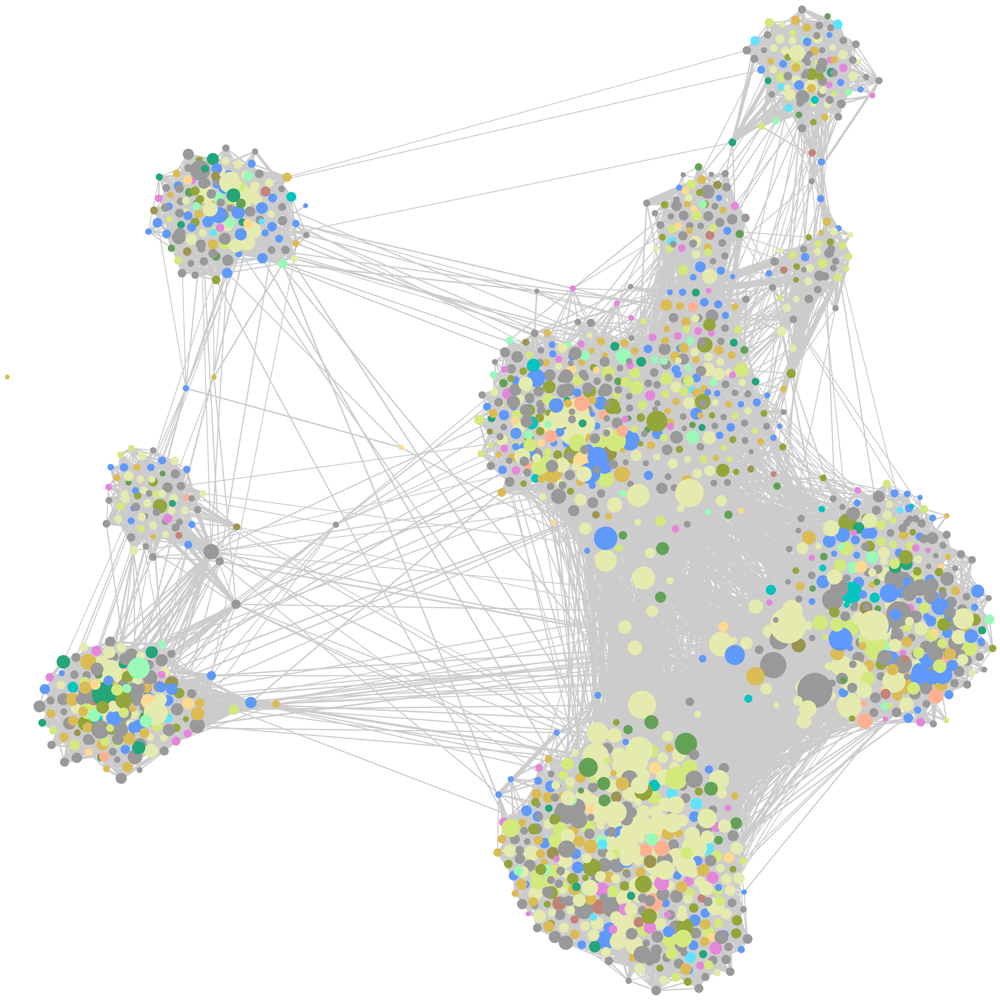

# Analyse de la consultation 

## Distribution des topics
Label|Distribution|Mots clefs
|--|--|--|
-1|491|sans - journalistes - médias (à ignorer)
0|320|école - jeunes - esprit critique
1|210|financement - concentration médias - milliardaires
2|160|sanctionner - pubs - arnaques
3|148|chaînes - arrêter - buzz
4|103|sources - véracité - obligatoirement
5|62|papier - journaux - rendre accessible
6|45|charte munich - créer - conseil
7|41|gauche - lfi - orienté
8|34|presse étrangère - plusieurs sources - diversifier sources information
9|28|laissent - journalistes restent - humilité
10|19|anonymat réseaux sociaux - réseaux sociaux interdire - supprimer
11|16|laisser liberté - liberté presse - influence
12|16|réseaux sociaux responsables - diffusent - détenteurs
13|16|intellectuels - donner parole experts - sujet
14|14|mieux informer - monde compris adultes - multiple diverse

## Distribution des documents par topic

## Distribution des co-votes par topic

