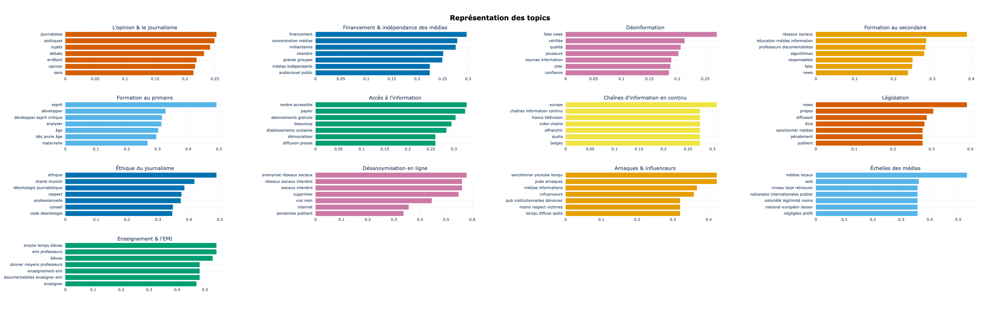
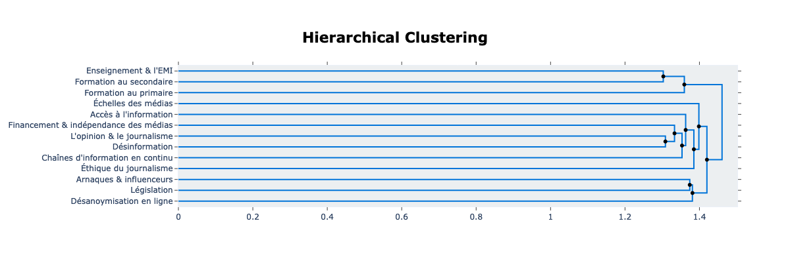

# Analyse des propositions de la consultation
## "Comment permettre à chacun de mieux s'informer"

### Contexte de la consultation Make.org
Dans le cadre du projet De Facto et a l'initiation de De Facto, CLEMI, SciencesPo, l'AFP, et XWiki SAS, l'organisation Make.org a été solicitée pour réaliser [une consultation](https://make.org/FR/consultation/mieux-sinformer/results) autour de la question de comment les français peuvent mieux s'informer. L'objectif de la consultation était de connaître quelles solutions et quels défis les français voient par rapport à la désinformation en ligne. L'organisation Make.org était en contacte avec 113 227 participants et elle a mené la consultation entre 27 juin 2022 et 31 octobre 2022. Parmi plus de cent mille participants, 2 023 solutions ont été proposées, et les participants ont contribué 526 858 votes sur la totalité des propositions, en votant pour, contre, ou neutre.

### Contexte de l'analyse Make.org
L'équipe de Make.org a mis en valeur sa consultation en réalisant une analyse linguistique et statistique des résultats. Contrairement à l'analyse du médialab, l'analyse de Make.org cherche à résumer les propositions qui rassemblaient le plus d'accord parmi les participants. L'objectif de cette approche était de livrer une liste de propositions qui montrent la position majoritaire des français. Parmi les 2 023 propositions données par les participants, l'équipe de Make.org a en considéré 1 723 valides au regard de sa charte de modération, et les a gardé pour l'analyse. En respectant l'objectif de montrer la position majoritaire, l'équipe de Make.org a ensuite séléctionné 1 063 propositions dont au moins 70% des votes sur la proposition était en faveur. Avec cet échantillon, l'équipe a fait sortir de la consultation 15 idées prioritaires qui résument les positions les plus souvent prises par les français par rapport à la question de comment mieux s'informer face à la désinformation en ligne.

### L'analyse par le médialab
Ayant reçu les résultats de l'analyse de la consultation, le médialab cherche à valoriser les données brutes de l'analyse en se posant d'autres questions de recherche que celle qui a principalement mené l'analyse de Make.org. Dans un premier temps, le médialab a fait une analyse linguistique sur les sujet discutés dans toutes les 1 723 propositions valides, sans regard pour la position prise dans la discussion. L'objectif de cette approche était de savoir quels soucis étaient derrière les idées proposées, même si les solutions se différent ou échouent de maintenir un fort soutient. Dans un deuxième temps, le médialab a fait une analyse de réseau pour savoir si certains sujets ont réuni l'accord de certain regroupements de participants.

# Question de recheche 1 : Sujets invoqués dans les propositions

La première question de recherche était de savoir quels sujets ont été invoqués dans les propositions données et votées par les participants de la consultation. Pour répondre à cette question, on a fait l'analyse linguistique qui s'appelle _topic modeling_, dans laquelle on extrait les sujets (topics) invoqués dans plusieurs documents de texte. La méthode qu'on a préféré est [`BERTopic`](https://maartengr.github.io/BERTopic/index.html).

## Idées inférées par la consultation de Make.org
Parmi les propositions favorables séléctionnées par l'équipe de Make.org, leur analyse a inféré 15 idées qui ensemble résument les positions majoritaires des participants.

1. Encourager une approche critique de l'information.
2. Renforcer l'éducation aux médias et à l'information à l'école.
3. Former à la détection des fake news et à la vérification de l'information.
4. Assurer l'indépendance éditoriale des médias.
5. Proposer une information plus diversifiée.
6. Réguler plus efficacement les réseaux sociaux.
7. Renforcer les pratiques de vérification de l'information.
8. Sanctionner la diffusion de fake news.
9. Sourcer et référencer autant que possible les information publiées.
10. ne pas céder à la culture de buzz et du sensationnel.
11. Lutter contre la concentration des médias.
12. Exiger davantage d'expertise dans le traitement de l'information.
13. Accroître la transparence sur le financement et les intérêts des médias.
14. Améliorer la protection des journalistes et des lanceurs d'alerte.
15. Mieux encadrer les publicités.

## Topics inférés par l'analyse du médialab

À la base d'une analyse _topic modeling_ est la transformation d'une chaîne de caractères en vecteur numérique, auquel on peut soumettre des algorithmes. Il y a plusieurs méthodes pour transformer ou "représenter" une phrase en vecteur ; on peut découper la phrase et représenter chaque mot en chiffres, ou on peut garder le contexte des mots en représentant chaque phrase en chiffres. Cette dernière technique, _sentence embedding_, est plus reconnue actuellement et est celle qu'on a préférée. Chaque phrase, quel que soit la longeur, se compose du même nombre de "dimensions" dans lesquelles se précisent les aspects uniques de la phrase. Les _embeddings_ nous permettent à prendre en compte le contexte des mots invoqués dans une phrase.

Afin de créer les _sentence embeddings_, on a profité d'un [_sentence transformer_](https://huggingface.co/dangvantuan/sentence-camembert-large) fine-tuné par le laboratoire français [La Javaness](https://www.lajavaness.com/) et basé sur le modèle linguistique français [CamemBERT](https://huggingface.co/camembert/camembert-large). Le modèle puissant CamemBERT est le modèle premier pour le français contemporain et a été développé par [Louis Martin, Benjamin Muller, Pedro Ortiz Suarez, Yoann Dupont, Laurent Romary, Éric Villemonte de la Clergerie, Djamé Seddah, et Benoît Sagot](https://camembert-model.fr/). Afin de s'adapter aux toutes les nuances d'une phrase, le _sentence embedding_ a forcement beaucoup de dimensions, pourtant il y en a trop pour qu'un algorithme puisse bien analyser la représentation. Du coup, on a réduit la complexité de la représentation en utilisant l'algorithme UMAP (_Uniform Manifold Approximation and Projection for Dimension Reduction_). Ensuite, les _embeddings_ des phrases ont été regroupés par l'algorithme HDBSCAN (_Hierarchical Density-Based Spatial Clustering of Applications with Noise_).

Le dernier étape de notre approche était donner un nom au clusters de phrases créés par l'algorithme HBDSCAN. Or on avait besoin d'encore transformer les mots et les phrases en vecteur afin de laisser un autre algorithme les analyser. Pour créér les représentations des topics, on a utilisé un autre _transformer_ que le _sentence transformer_ et une autre technique. Cette fois, on a utilisé le c-TF-IDF (_Class-based term frequency-inverse document frequency_), qui se base sur le _TfidfTransformer_ de scikit-learn. Pour terminer, on a relu les topics à la main. On en a mergé certains et leur tous donner un nom compréhensif.

L'analyse du médialab a inféré 13 topic invoqués dans les 1 723 propositions valides de la consultation.

1. L'opinion et le journalisme
    - Invoqué dans 263 propositions.
    - Les mots ou les phrases les plus représentatifs:
        - journalistes
        - politiques
        - sujets
        - débats
        - arrêtent
        - opinion
    - Des propositions représentatives:
        - Il faut que les journalistes des médias, télévisions, radios arrêtent de donner leur avis en permanence.
        - Il faut que les journalistes se drapent d'humilité et arrêtent de voir dans le journalisme un métier d'ambitions personnelles.
        - Il faut organiser la mise en débat publique des idées sur des temps assez longs pour permettre aux contradicteurs d'argumenter leur position

2. Financement et l'indépendance des médias
    - Invoqué dans 210 propositions.
    - Les mots ou les phrases les plus représentatifs:
        - financement
        - concentration médias
        - milliardaires
        - interdire
        - grands groupes
        - médias indépendants
    - Des propositions représentatives:
        - Il faut que les médias soient financés en partie par les finances publiques et en partie par le secteur privé, mais en toute transparence.
        - Il faut que la loi empêche l'achat de médias par une ou plusieurs personnes. L'information n'est pas une marchandise.
        - Il faut que les médias français ne soit plus possédé par 8 milliardaires qui protègent leurs intérêts
3. Désinformation
    - Invoqué dans 178 propositions.
    - Les mots ou les phrases les plus représentatifs:
        - fake news
        - vérifiée
        - qualité
        - plusieurs
        - sources information
        - citer
    - Des propositions représentatives:
        - Il faut que chaque publication cite obligatoirement ses sources.
        - Il faut former un organisme de débunk de fake news de qualité et forcer les algorithmes de recommandations à largement partager leur travail.
        - Il faut des experts en désamorçage de fake news, reconnus et crédibles.
4. Formation au secondaire
    - Invoqué dans 152 propositions.
    - Les mots ou les phrases les plus représentatifs:
        - réseaux sociaux
        - éducation médias information
        - professeurs documentalistes
        - algorithmes
        - responsables
        - fake
    - Des propositions représentatives:
        - Il faut faire de l'éducation aux médias et à l'information, une grande cause nationale.
        - Il faut que l'école explique le fonctionnement des réseaux sociaux à chaque enfant pour qu'ils comprennent la perversité des mécanismes.
        - Il faut créer une discipline d'information-documentation dispensée par les professeurs documentalistes pour tous les élèves du secondaire.
5. Formation au primaire
    - Invoqué dans 85 propositions.
    - Les mots ou les phrases les plus représentatifs:
        - esprit
        - développer
        - développer esprit critique
        - analyser
        - âge
        - dès jeune âge
    - Des propositions représentatives:
        - Il faut généraliser depuis l'école primaire un apprentissage de l'esprit critique.
        - Il faut apprendre très tôt, à développer son esprit critique. Cours ludiques et dédiés.
        - Il faut développer et renforcer les compétences psycho-sociales dès l'école maternelle, et ce, jusqu'à l'âge adulte.
6. Accès à l'information
    - Invoqué dans 51 propositions.
    - Les mots ou les phrases les plus représentatifs:
        - rendre accessible
        - papier
        - abonnements gratuits
        - beaucoup
        - établissements scolaires
        - démocratiser
    - Des propositions représentatives:
        - Il faut faciliter l'accès financier aux médias sous forme numérique. Ils sont trop chers.
        - Il faut voir comment fournir une offre d'informations de qualité à un prix accessible aux plus pauvres.
        - Il faut permettre un abonnement en ligne à un panel de titres de presse d'information avec une ristourne pour les étudiants, chômeurs etc.
7. Chaînes d'information en continu
    - Invoqué dans 47 propositions.
    - Les mots ou les phrases les plus représentatifs:
        - europe
        - chaînes information continu
        - france télévision
        - créer chaîne
        - affranchir
        - quota
    - Des propositions représentatives:
        - Il faut limiter les chaines d'info en boucle sources de conditionnement et favoriser, par un financement public, celles qui font réfléchir.
        - Il faut des chaînes d’informations indépendantes à la télévision, et libres de paroles.
        - Il faut que les chaînes d’information en continu soient supprimées pour arrêter la pratique du vide.
8. Législation
    - Invoqué dans 46 propositions.
    - Les mots ou les phrases les plus représentatifs:
        - news
        - propos
        - diffusant
        - élus
        - sanctionner médias
        - pénalement
    - Des propositions représentatives:
        - Il faut sanctionner les médias qui diffusent trop de fake news : retrait licence journalisme, suspension d’audience, déconnexion du site web.
        - Il faut que les auteurs de fake News soient sanctionnés pénalement et financièrement.
        - Il faut punir financièrement et fortement les auteurs de fausses info ainsi que les médias, supports, plateformes etc.... qui les diffusent.
9. Éthique du journalisme
    - Invoqué dans 45 propositions.
    - Les mots ou les phrases les plus représentatifs:
        - éthique
        - charte munique
        - déontologie journalistique
        - respect
        - professionnelle
        - conseil
    - Des propositions représentatives:
        - Il faut inclure dans toutes les formations dédiées, un code de déontologie, voire un serment, à l'image des médecins (Hippocrate).
        - Il faut créer un organisme indépendant pour contrôler le travail des médias et le respect de l’éthique journalistique.
        - Il faut transformer le « Conseil de déontologie des médias » créé en 2019 en véritable contre-pouvoir citoyen.
10. Désanonymisation en ligne
    - Invoqué dans 24 propositions.
    - Les mots ou les phrases les plus représentatifs:
        - anonymat réseaux sociaux
        - réseaux sociaux interdir
        - sociaux interdire
        - supprimer
        - vrai nom
        - internet
    - Des propositions représentatives:
        - Il faut protéger les utilisateurs d’Internet et des réseaux sociaux contre toute atteinte résultant de l’utilisation de leurs données.
        - Il faut supprimer l'anonymat sur les réseaux sociaux.
        - Il faut interdire les réseaux sociaux ou obliger de donner sa véritable identité pour poster.
11. Arnaques et influenceurs
    - Invoqué dans 20 propositions.
    - Les mots ou les phrases les plus représentatifs:
        - sanctionner youtube lorqu
        - pubs arnaques
        - médias informations
        - influenceurs
        - pub institutinonelles dénoncer
        - moins respect victimes
    - Des propositions représentatives:
        - Il faut responsabiliser les médias d'informations qui alertent sur les arnaques alors qu'ils laissent eux-mêmes ce type de pub sur leur site.
        - Il faut imposer aux médias de signaler les espaces publicitaires/ partenariats avec un symbole uniformisé clairement visible.
        - Il faut ne plus autoriser de publicité après des informations dramatiques, au moins par respect pour les victimes et leurs familles.
12. Échelles des médias
    - Invoqué dans 17 propositions.
    - Les mots ou les phrases les plus représentatifs:
        - médias locaux
        - web
        - niveau local retrouver
        - nationales internationales publier
        - notoriété légitimté moins
        - national européen laisser
    - Des propositions représentatives:
        - Il faut remettre en avant les médias (presse, site web, app...) pour s'informer sur les actualités locales.
        - Il faut remettre en avant l'actualité des territoires en diffusant plus facilement les actualités locales sur le web et dans les médias.
        - Il faut laisser aux chaines régionales et à la PQR le traitement de l'info du village et traiter plus souvent de l'international.
13. Enseignment et l'EMI (Éducation aux médias et à l'information)
    - Invoqué dans 16 propositions.
    - Les mots ou les phrases les plus représentatifs:
        - emploi temps élèves
        - emi professeurs
        - élèves
        - donner moyens professeurs
        - enseignement emi
        - documentalistes enseigner emi
    - Des propositions représentatives:
        - Il faut prévoir dans l'emploi du temps 1h par semaine pour que les professeurs documentalistes puissent former les élèves à l'EMI.
        - Il faut donner les moyens aux professeurs documentalistes d'exercer une véritable formation à l'EMI avec une progression du collège au lycée.
        - Il faut inscrire l'EMI dans l'emploi du temps des élèves de la 6e à la Terminale gérée par les profs docs dont c'est le domaine d'expertise.

569 propositions ne se tiennent pas suffisament à aucun topic inféré.

## Analyse de la distribution des topics
Les algorithmes ont détecté et distingué trois sujets liés à l'éducation. Premièrement, au moins 16 propositions ont discuté la profession de l'enseignement et l'EMI (Éducation aux médias et à l'information) en particulier. Deuxièmement, au moins 85 propositions ont discuté l'education dans les écoles maternelles. Troisièmement, au moins 152 propositions ont discuté l'éducation des jeunes en général et spécifiquement dans les écoles secondaires. Au lieu de dire simplement que l'éducation s'inquiètent les participants pendant qu'ils répondent à la question de comment mieux s'informer, on peut dire que leurs soucis se concentrent surtout aux habitudes et aux compétences critiques des jeunes en secondaire, qui ne faisaient pas partie de la consultation dont l'âge moyen des participants était environ 50 ans.

Le regroupement des propositions qu'on a appelé « Formation au secondaire » inclut des propositions qui ciblent explicitement l'éducation en secondaire et des propositions qui utilisent souvent les mots « fake » et « réseaux sociaux ». Pour faire le compairison, le regroupement qu'on a appelé « Formation au primaire » est bien plus optimiste. Par rapport au topic de l'éducation aux écoles secondaires, qui parlent des réseaux sociaux, des algorithmes, et du « fake news », le topic de l'éducuation aux écoles primaires parlent du développement, de l'âge, de l'esprit, et pas beaucoup sur les outils numériques qui diffusent le _fake news_ ni sur le _fake news_ lui-même. En d'autre termes, les deux topics inférés se distinquent par de l'un côté un focus sur la diffusion de la désinformation vers les jeunes par les réseaux sociaux et de l'autre côté le développement de l'esprit critique dès un jeune âge.

Donné la déséquilibre entre la proportion de propositions concernées par l'éducation dans les écoles secondaires et celle dans les écoles primaries, il semble que les participants ont pensé bien plus fortement aux adolescents qu'aux enfants en se posant des questions sur la désinformation en ligne. De l'un côté, il se peut que ce biais relève une supposition répandue chez les participants que les adolescents sont, en général, plus en ligne que les enfants et donc plus exposés à la désinformation, et cette supposition a l'air d'être correcte puisque les enfants en maternelle sont moins en ligne par rapport aux jeunes au collège et lycée.

De l'autre côté, il se peut que le biais chez les participants relève une deuxième supposition que les adolescents sont spécialement susceptibles à la désinformation en ligne par rapport à la population en général. Cette supposition, pourtant, n'est pas bien justifiée. Chercheuse sur le projet De Facto et doctorante au médialab, Manon Berriche a méné une enquête dans un collège pour examiner comment les adolescents recoivent et interprètent la désinformation en ligne. Elle a trouvé que les adolescents savent prêter attention au caractère d'une information en ligne et à sa factualité. Dans son enquête, Berriche a vu les jeunes participants réuissent souvent à l'identification de _fake news_. Par contre, quand les adolescents tombent sur du _fake news_ ou des rumeurs, leur décision d'en mettre en circulation ou pas dépend sur le contexte social. Berriche a trouvé que quand les participants étaient dans une espace privé ou quand ils se disposaient de l'anonymité, ils ont plus souvent partagé de la désinformation, surtout s'il permettrait de « renforcer leur socialbilité »[ˆ1].

[ˆ1]:Berriche, M. (Forthcoming). Back to school. Do teenagers receive and share (false) information in all situations? _Les enjeux de l'information ou de la communication_.

## Analyse de la proximité entre topics
Certains sujets invoqués dans les propositions sont liés à l'un et l'autre, tels que les deux qui discutent l'éducation des jeunes et celui qui discute l'enseignement. Un regroupement hiérarchique (_hierarchical clustering analysis_ ou HCA) montre la proximité entre les représentations des topics inférés par les algorithmes. On a implementé la méthode Ward pour relever la proximité entre topics.

Comme attendu, le regroupement hiérarchique relève une proximité entre les trois sujets qui appartienent aux discussions de l'éducation : `Enseignement & L'EMI`, `Formation au secondaire`, `Formation au primaire`. Plus intéressante est la proximité que montre le regroupement hiérarchique entre la discussion de la désinformation (`Désinformation`) et la discussion de l'opinion dans le journalisme (`L'opinion & le journalisme`). En outre, la discussion sur la législation (`Legislation`) se lie à deux des sujets en particulier. Dans un premier temps, le regroupement hiérarchique trouve que la législation est liée aux soucis sur les arnaques et les influenceurs en ligne (`Arnaques & influenceurs`). Dans un deuxième temps, elle se lie aussi à la question de la désanoymisation en ligne (`Désanoymisation en ligne`).

## Analyse de la similarité entre topics
La similarité cosinus est une autre méthode mathématique pour examiner les relations entre les représentations des topics inférés. Cette méthode prend les représentations de deux topics et détermine le cosinus de leur angle. En mettant ces calculations dans une matrice, où la similarité cosinus de chaque pair de représentations occupe un carré, des nouvelles relations ressortent.

L'idée de législation (`Legislation`) se tient le plus aux propositions qui discutent l'éducation dans les écoles secondaires (`Formation au secondaire`). D'un dégré moins important, la législation (`Legislation`) est aussi liée aux discussions sur l'accès à l'information (`Accès à l'information`). Contrairement au regroupement hierarchique, l'analyse par la similarité cosinus suggère que la similarité entre les trois topics sur l'éducation n'est pas si forte. Selon cette dernière analyse, trois topics en particulier, l'éducation dans les écoles secondaires (`Formation au secondaire`), l'accès à l'information (`Accès à l'information`), et la législation (`Legislation`), ont les relations entre eux les plus importantes.

# Question de recherche 2 : Analyse de la vote sur les propositions

La deuxième question de recherche s'appuie sur les votes qu'ont reçu les propositions. Les données brutes de l'analyse de Make.org se composent d'un part les propositions et d'un autre part une matrice des votes sur les propositions. Le dernier met en binôme chaque proposition avec une autre proposition et montre comment les participants ont voté pour les deux.

Par exemple, disons qu'on a une proposition qui discute de l'école primaire et une autre qui discute des chaînes d'informations. Quand un participant répond aux deux propositions, ses deux votes vont se trouvent dans l'un des cinq catégories possibles. Le participant peut voter pour la première proposition sur l'école primaire et contre la deuxième sur les chaînes d'informations. Le participant peut être d'accord avec les deux propositions. Il peut être d'accord avec la première mais neutre sur la deuxième. Il peut voter contre la premièr sur l'école primaire et voter pour la deuxième. Enfin, le participant peut ne pas avoir un avis sur la première proposition et être d'accord avec la deuxième. La matrice qu'a construite l'équipe de Make.org compte, pour chaque proposition, le nombre des votes qui se trouvent dans chacun de ces cinq catégories.

|Proposition A|Proposition B|Type de vote sur Proposition A|Type de vote sur Proposition B|Nombre de votes de ce type sur Proposition A|Somme de votes sur Proposition A quand le participant a aussi voté sur Proposition B|
|--|--|--|--|--|--|
Il faut depuis l'école primaire...|Il faut des chaînes d’informations...|agree|disagree|9|41
Il faut depuis l'école primaire...|Il faut des chaînes d’informations...|agree|agree|24|41
Il faut depuis l'école primaire...|Il faut des chaînes d’informations...|agree|neutral|6|41
Il faut depuis l'école primaire...|Il faut des chaînes d’informations...|disagree|agree|1|41
Il faut depuis l'école primaire...|Il faut des chaînes d’informations...|neutral|agree|1|41

## Accord entre propositions par topic de la proposition

    <table>
        <tr>
            <th>Couleur</th>
            <th>Topic</th>
        </tr>
        <tr>
            <td style="background-color: #6b7f38 ; padding: 10px;"></td>
            <td>L'opinion & le journalisme</td>
        </tr>
        <tr>
            <td style="background-color: #7d64d1 ; padding: 10px;"></td>
            <td>Financement & indépendance des médias</td>
        </tr>
        <tr>
            <td style="background-color: #5fb651 ; padding: 10px;"></td>
            <td>Désinformation</td>
        </tr>
        <tr>
            <td style="background-color: #c352b3 ; padding: 10px;"></td>
            <td>Formation au secondaire</td>
        </tr>
        <tr>
            <td style="background-color: #b3b540 ; padding: 10px;"></td>
            <td>Formation au primaire</td>
        </tr>
        <tr>
            <td style="background-color: #7e7cc6 ; padding: 10px;"></td>
            <td>Accès à l'information</td>
        </tr>
        <tr>
            <td style="background-color: #c58c44 ; padding: 10px;"></td>
            <td>Chaînes d'information en continu</td>
        </tr>
        <tr>
            <td style="background-color: #509dd4 ; padding: 10px;"></td>
            <td>Législation</td>
        </tr>
        <tr>
            <td style="background-color: #c75832 ; padding: 10px;"></td>
            <td>Éthique du journalisme</td>
        </tr>
        <tr>
            <td style="background-color: #4baf91 ; padding: 10px;"></td>
            <td>Désanoymisation en ligne</td>
        </tr>
        <tr>
            <td style="background-color: #d44c62 ; padding: 10px;"></td>
            <td>Arnaques & influenceurs</td>
        </tr>
        <tr>
            <td style="background-color: #de85b0 ; padding: 10px;"></td>
            <td>Échelles des médias</td>
        </tr>
        <tr>
            <td style="background-color: #a0486c ; padding: 10px;"></td>
            <td>Enseignement & l'EMI</td>
        </tr>
    </table>

## Accord entre propositions par l'âge de l'auteur de la proposition

    <table>
        <tr>
            <th>Couleur</th>
            <th>Âge
        </tr>
        <tr>
            <td style="background-color: #ffff00 ; padding: 10px;"></td>
            <td>Jeune</td>
        </tr>
        <tr>
            <td style="background-color: #0000ff ; padding: 10px;"></td>
            <td>Vieux</td>
        </tr>
    </table>

