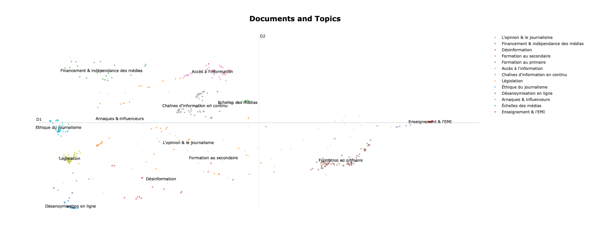

# Analyse linguistique des propositions
## "Comment permettre à chacun de mieux s'informer"

### Les chiffres de participation
- 1 723 propositions validées de la consultation

### Les dates de la consultation
- début : 27/06/2022
- fin : 31/10/2022

# Topics inférés par la consultation make.org
0. Encourager une approche critique de l'information
2. Renforcer l'éducation aux médias et à l'information à l'école
3. Former à la détection des fake news et à la vérification de l'information
4. Assurer l'indépendance éditoriale des médias
5. Proposer une information plus diversifiée
6. Réguler plus efficacement les réseaux sociaux
7. Renforcer les pratiques de vérification de l'information
8. Sanctionner la diffusion de fake news
9. Sourcer et référencer autant que possible les information publiées
10. ne pas céder à la culture de buzz et du sensationnel
11. Lutter contre la concentration des médias
12. Exiger davantage d'expertise dans le traitement de l'information
13. Accroître la transparence sur le financement et les intérêts des médias
14. Améliorer la protection des journalistes et des lanceurs d'alerte
15. Mieux encadrer les publicités

# Topics inférés par l'analyse médialab
*null. éducation médias  --  jeunes  --  donner  --  citoyens  --  informer*

0.  financement  --  concentration médias  --  milliardaires  --  indépendants  --  indépendance médias'
1. fake news  --  vérifiée  --  qualité  --  plusieurs  --  sources information
2. réseaux sociaux  --  éducation médias information  --  professeurs documentalistes  --  facebook  --  responsables
3. experts  --  opinion  --  différence entre  --  pensée  --  gauche
4. sujets  --  buzz  --  faits divers  --  jt  --  info
5. analyser  --  école  --  apprendre  --  jeune âge  --  développer
6. arrêtent  --  conditionnel  --  sans  --  être  --  essaient
7. presse  --  acheter  --  rendre accessible  --  papier  --  gratuité
8. continu  --  ue  --  chaînes information  --  belges  --  affranchir
9. auteurs  --  financièrement  --  amendes  --  diffusant  --  élus
10. éthique  --  charte munich  --  conseil déontologie  --  médecins  --  code déontologie
11. anonymat réseaux sociaux  --  réseaux sociaux interdire  --  sociaux interdire  --  supprimer  --  vrai nom
12. sanctionner youtube lorsqu  --  pubs arnaques  --  médias informations  --  influenceurs  --  pub institutionnelles dénoncer
13. médias locaux  --  france  --  national européen laisser  --  nationales internationales publier  --  niveau local retrouver
14. dès école maternelle  --  permettre enfants  --  psycho  --  éducation civique  --  éducation nationale
15. analyser mieux  --  suivi  --  scientifiques  --  peut perdre  --  petit récapitulatif temps
16. emploi temps élèves  --  élèves  --  donner moyens professeurs  --  documentalistes enseigner emi  --  enseignement emi professeurs

## Décomposition des topics

Merger des topics ci-dessous et/ou proposer des nouveaux titres qui résume le topic.

|||||
|--|--|--|--|
|numéro|représentation|merge|titre|
|||||
|0|financement  --  concentration médias  --  milliardaires  --  indépendants  --  indépendance médias||
|1|fake news  --  vérifiée  --  qualité  --  plusieurs  --  sources information||
|2|réseaux sociaux  --  éducation médias information  --  professeurs documentalistes  --  facebook  --  responsables||
|3|experts  --  opinion  --  différence entre  --  pensée  --  gauche
|4|sujets  --  buzz  --  faits divers  --  jt  --  info||
|5|analyser  --  école  --  apprendre  --  jeune âge  --  développer||
|6|arrêtent  --  conditionnel  --  sans  --  être  --  essaient||
|7|presse  --  acheter  --  rendre accessible  --  papier  --  gratuité||
|8|continu  --  ue  --  chaînes information  --  belges  --  affranchir||
|9|auteurs  --  financièrement  --  amendes  --  diffusant  --  élus||
|10|éthique  --  charte munich  --  conseil déontologie  --  médecins  --  code déontologie||
|11|anonymat réseaux sociaux  --  réseaux sociaux interdire  --  sociaux interdire  --  supprimer  --  vrai nom||
|12|sanctionner youtube lorsqu  --  pubs arnaques  --  médias informations  --  influenceurs  --  pub institutionnelles dénoncer||
|13|médias locaux  --  france  --  national européen laisser  --  nationales internationales publier  --  niveau local retrouver||
|14|dès école maternelle  --  permettre enfants  --  psycho  --  éducation civique  --  éducation nationale||
|15|analyser mieux  --  suivi  --  scientifiques  --  peut perdre  --  petit récapitulatif temps||
|16|emploi temps élèves  --  élèves  --  donner moyens professeurs  --  documentalistes enseigner emi  --  enseignement emi professeurs||
|||||

## Similarité entre topics

## Distribution des documents

