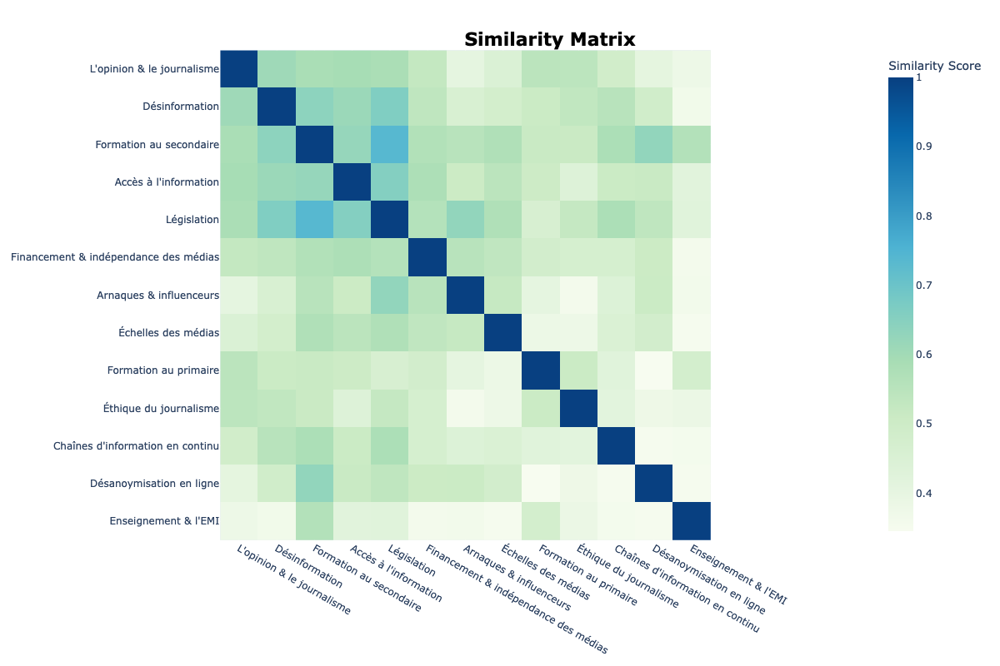

# Analyse linguistique des propositions
## "Comment permettre à chacun de mieux s'informer"

### Les chiffres de participation
- 1 723 propositions validées de la consultation

### Les dates de la consultation
- début : 27/06/2022
- fin : 31/10/2022

# Topics inférés par la consultation make.org
0. Encourager une approche critique de l'information
2. Renforcer l'éducation aux médias et à l'information à l'école
3. Former à la détection des fake news et à la vérification de l'information
4. Assurer l'indépendance éditoriale des médias
5. Proposer une information plus diversifiée
6. Réguler plus efficacement les réseaux sociaux
7. Renforcer les pratiques de vérification de l'information
8. Sanctionner la diffusion de fake news
9. Sourcer et référencer autant que possible les information publiées
10. ne pas céder à la culture de buzz et du sensationnel
11. Lutter contre la concentration des médias
12. Exiger davantage d'expertise dans le traitement de l'information
13. Accroître la transparence sur le financement et les intérêts des médias
14. Améliorer la protection des journalistes et des lanceurs d'alerte
15. Mieux encadrer les publicités

# Topics inférés par l'analyse médialab

## Décomposition des topics

## Similarité entre topics

## Distribution des documents

# Analyse de réseau

## Accord entre propositions par topic de la proposition

## Accord entre propositions par l'âge de l'auteur de la proposition

## Accord entre proposition par la génération de l'auteur de la proposition

