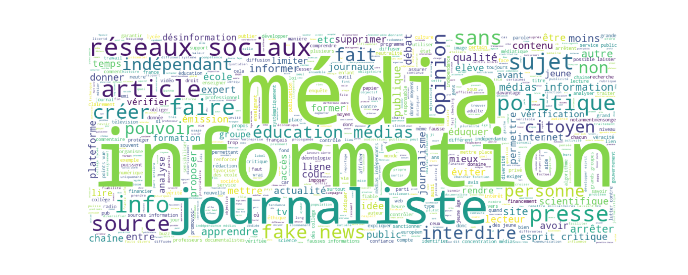
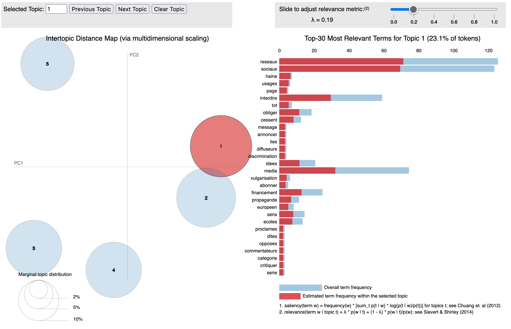

Python 3.10.4 | [dependencies](requirements.txt)
# Word Cloud
Using the Python library [`WordCloud`](https://pypi.org/project/wordcloud/), make a word cloud from a column (`COLUMN`) in a given CSV file (`DATAFILE`).

```shell
$ python cloud.py COLUMN DATAFILE
```


# LDA (not optimized)
Using `gensim`, make an LDA model that infers a certain number of topics (`num-topics`) in the data (`DATAFILE`). The function will deliver a dynamic visualization of the topic modeling using `pyLDAvis`. The visualization should automatically open a new tab in your default web browswer. However, you can open it yourself from the absolute file path printed in the console upon the script's conclusion.
```shell
$ python simple_lda.py --num-topics 5 COLUMN DATAFILE
```


# TF-IDF (customized)

```shell
$ python tf_idf.py --max_df 0.4 --min_df 5 --clusters 6 --members 5 COLUMN DATAFILE
```

Customize the command with a maximum document frequency (`--max_df`, float), a minimum document frequency (`--min_df`, integer), a number of clusters (`--clusters`, integer), and the number of terms that compose a cluster (`--members`, integer).

|cluster|mem_1|mem_2|mem_3|mem_4|mem_5|
|-|-|-|-|-|-|
1|fake|news|fake news|réseaux|réseaux sociaux
2|éducation|éducation médias|médias information|médias|information
3|médias|indépendance|informations|indépendants|presse
4|journalistes|médias|politiques|sans|sujets
5|non|chaînes|information|médias|informations
6|information|informations|réseaux|sociaux|réseaux sociaux
